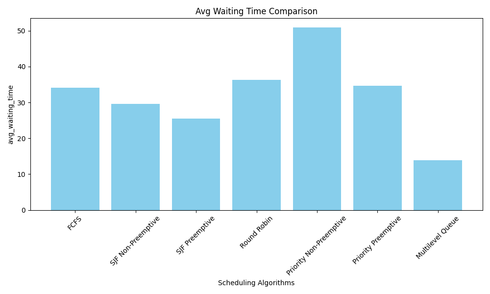

# CPU Scheduling Algorithms Simulation

This project is a simulation of various CPU scheduling algorithms implemented in Python. It aims to deepen understanding of CPU scheduling by simulating process generation, applying scheduling algorithms, and measuring performance using both preemptive and non-preemptive scheduling techniques.

## Table of Contents

- [Introduction](#introduction)
- [Features](#features)
- [Directory Structure](#directory-structure)
- [Prerequisites](#prerequisites)
- [Installation](#installation)
- [Usage](#usage)
- [Modules Description](#modules-description)
- [Simulation Output](#simulation-output)
- [Visualization](#visualization)
- [Shortcuts](#shortcuts)
- [Contact](#contact)

## Introduction

The simulation generates 20 processes with random arrival and burst times. Each scheduling algorithm is tested in both preemptive and non-preemptive modes (where applicable). The performance of each algorithm is measured using metrics such as average turnaround time, average waiting time, CPU utilization, and throughput.

## Features

- Implementation of the following CPU scheduling algorithms:
  - First-Come, First-Served (FCFS)
  - Shortest Job First (SJF) (Preemptive and Non-Preemptive)
  - Round Robin (RR)
  - Priority Scheduling (Preemptive and Non-Preemptive)
  - Multilevel Queue Scheduling
- Simulation of process generation with random arrival and burst times
- Performance measurement and comparison for each algorithm
- Visualization of performance metrics using matplotlib

## Directory Structure

```
├── README.md
├── algorithm.py  # Contains scheduling algorithms
├── main.py  # Entry point of the simulation
├── metric.py  # Performance metrics calculation
├── schema.py  # Data classes for processes and performance
└── utils.py  # Utility functions
```

## Prerequisites

- Python 3.6 or higher


## Installation

1. Clone the repository:
```bash
git clone https://github.com/Kamran151199/cpu-scheduling-simulation.git
```

2. Navigate to the project directory:
```bash
cd cpu-scheduling-simulation
```

3. Install required packages:
```bash
pip install -r requirements.txt
```

## Usage

Run the main script to execute the simulation:

```bash
python main.py
```

This will:
- Generate 20 processes with random attributes
- Run each scheduling algorithm
- Calculate and display performance metrics
- Generate and display comparison charts for the metrics

## Modules Description

- `main.py`: The entry point of the simulation. It orchestrates the process generation, algorithm execution, and results visualization
- `algorithm.py`: Contains implementations of the CPU scheduling algorithms
- `metric.py`: Defines functions to calculate performance metrics
- `schema.py`: Contains data classes (Process and Performance) representing the processes and performance metrics
- `utils.py`: Provides utility functions used across the simulation (e.g., proper naming from variables, process generation)

## Simulation Output

After running the simulation, you will see:
- Performance metrics printed on the console for each algorithm
- Bar charts comparing the algorithms based on:
  - Average Waiting Time
  - Average Turnaround Time
  - CPU Utilization
  - Throughput

## Visualization

The simulation uses matplotlib to generate bar charts that visually compare the performance of different scheduling algorithms.

Example chart:



*Note: The actual images will be generated when you run the simulation.*

## Shortcuts

To quickly get started:

- Run Simulation:
```bash
python main.py
```

- Modify Process Generation:
  - Edit the `generate_processes()` function in `utils.py` to change the number of processes or the range of arrival and burst times
- Adjust Time Quantum:
  - In `algorithm.py`, you can adjust the `time_quantum` variable in the Round Robin and Multilevel Queue scheduling functions

## Contact

For any questions or suggestions, please contact:

- Name: Komron Valijonov
- Email: komron.valijonov@ue-germany.de
