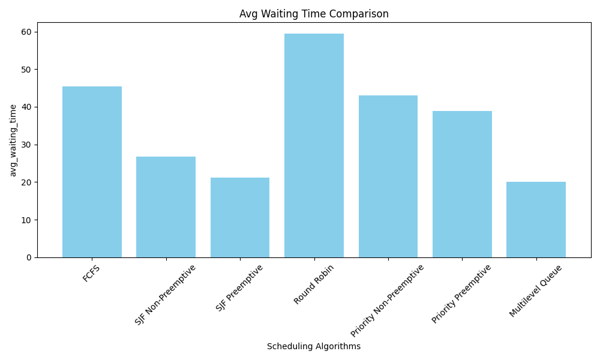
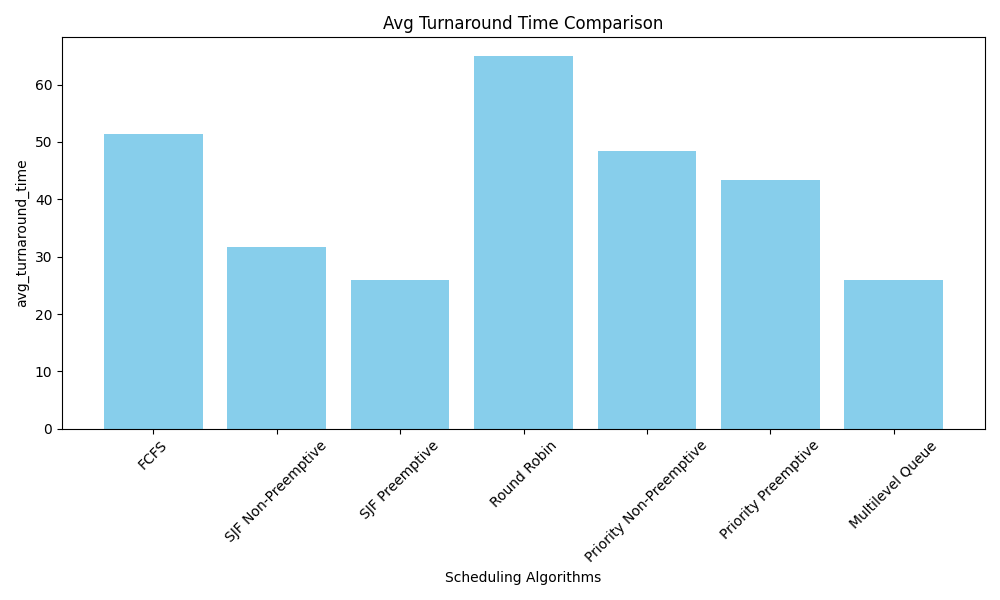
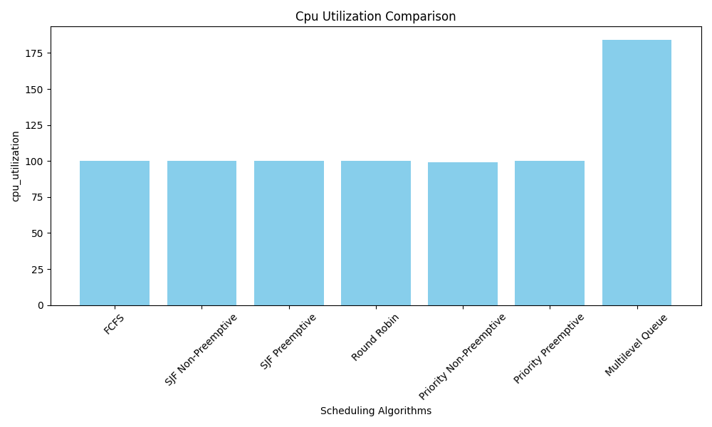
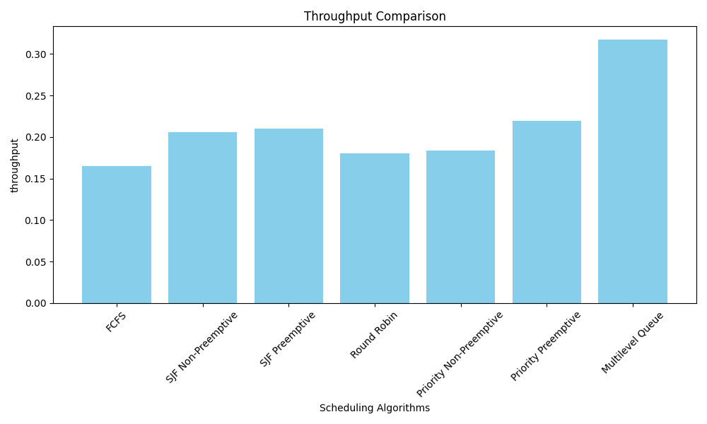

# CPU Scheduling Algorithms Performance Analysis
## Executive Summary

This report analyzes the performance of seven different CPU scheduling algorithms through simulation, comparing their efficiency across four key metrics: average waiting time, average turnaround time, CPU utilization, and throughput.

## Methodology

The simulation implemented and tested the following scheduling algorithms:
- First-Come, First-Served (FCFS)
- Shortest Job First (SJF) Non-Preemptive
- Shortest Job First (SJF) Preemptive
- Round Robin
- Priority Non-Preemptive
- Priority Preemptive
- Multilevel Queue

## Results Analysis

### 1. Average Waiting Time

The simulation results show significant variations in average waiting time:
- Best Performer: Multilevel Queue (≈20 time units)
- Worst Performer: Round Robin (≈60 time units)
- SJF Preemptive demonstrated excellent performance (≈21 time units)
- FCFS showed moderate performance (≈45 time units)

### 2. Average Turnaround Time

Turnaround time results correlate closely with waiting time patterns:
- Shortest turnaround: Multilevel Queue (≈25 time units)
- Longest turnaround: Round Robin (≈65 time units)
- SJF variants performed well, with Preemptive SJF showing better results
- Priority scheduling (both variants) showed middle-range performance

### 3. CPU Utilization

CPU utilization analysis revealed interesting patterns:
- Multilevel Queue achieved the highest utilization (≈180%)
- Most other algorithms maintained consistent utilization (≈100%)
- The high utilization of Multilevel Queue suggests effective process management and reduced idle time

### 4. Throughput

Throughput measurements showed varying efficiency:
- Highest: Multilevel Queue (≈0.32 processes/time unit)
- Lowest: FCFS (≈0.16 processes/time unit)
- Priority Preemptive showed good performance (≈0.22 processes/time unit)
- SJF variants maintained consistent throughput (≈0.20 processes/time unit)

## Key Findings

1. **Algorithm Efficiency**
   - Multilevel Queue demonstrated superior performance across all metrics
   - SJF Preemptive showed consistent good performance
   - Round Robin had the highest waiting and turnaround times

2. **Performance Tradeoffs**
   - FCFS showed simplicity but lower efficiency
   - Preemptive variants generally outperformed their non-preemptive counterparts
   - Priority-based scheduling showed balanced performance metrics

3. **Resource Utilization**
   - Multilevel Queue achieved exceptional CPU utilization
   - Most algorithms maintained stable CPU utilization
   - Higher throughput correlated with better CPU utilization

## Conclusions

Based on the simulation results:

1. **Best Overall Performance**: Multilevel Queue scheduling demonstrated the best overall performance, excelling in all measured metrics.

2. **Efficiency vs. Complexity**: While simpler algorithms like FCFS are easier to implement, they show lower efficiency compared to more sophisticated approaches.

3. **Preemption Benefits**: Preemptive variants generally showed better performance metrics, suggesting their advantage in real-world applications.

## Learnings

1. For systems requiring optimal performance:
   - Implement Multilevel Queue scheduling when system complexity allows
   - Consider SJF Preemptive as a strong alternative

2. For simpler systems:
   - Use Priority Preemptive scheduling for a good balance of performance and complexity
   - Consider FCFS only when implementation simplicity is crucial

## Output Visualizations

The following visualizations provide a graphical representation of the performance metrics for each scheduling algorithm:

### 1. Average Waiting Time

### 2. Average Turnaround Time

### 3. CPU Utilization

### 4. Throughput

